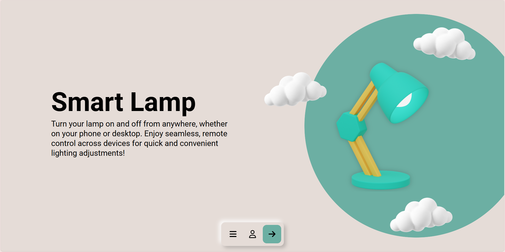
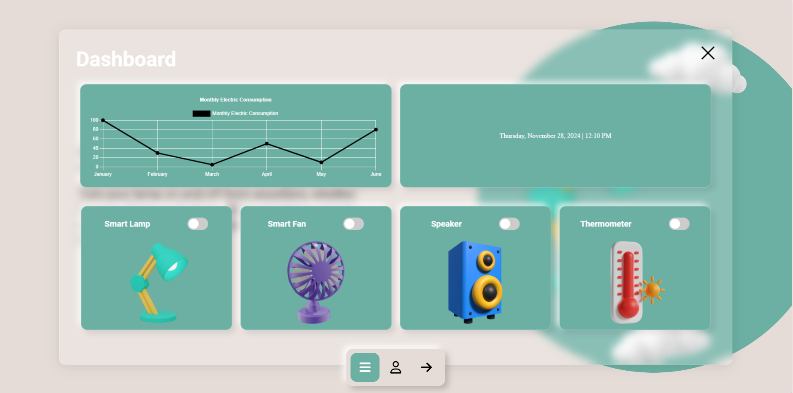

  

<h1 align="center">InSync - Smart-Control-System</h1>

  <strong>InSync - Smart Control System</strong> is a comprehensive platform designed to give users seamless control over their smart home devices through a web interface. It enables real-time monitoring and management of a variety of devices, including lights, door locks, air quality monitors, and climate controls. With a focus on intuitive design and ease of use, InSync offers customizable automation, efficient data handling, and a fully responsive interface. The result is an integrated smart home experience that adapts to the user's needs, making home automation simple, convenient, and effective.

## Table of Contents
1.  [About the Project](#about-the-project)
2.  [Key Features](#key-features)
4.  [Usage](#usage)
5.  [Technologies Used](#technologies-used)
6.  [Screenshots](#screenshots)
7.  [Contributing](#contributing)
9.  [About The Developers](#about-the-developers)

## About the Project
**InSync - Smart Control System** is a user-friendly platform that enables seamless management of smart home devices through a web interface. It allows users to monitor and control various devices like lighting, door locks, climate control, and air quality sensors. With a focus on intuitive design, real-time device control, and responsive automation, InSync simplifies the integration and management of smart home systems, offering a streamlined user experience.

## Key Features
### 🎛️ Device Control & Monitoring
- Real-time control of multiple smart home devices
- Instant device status updates and monitoring
- Support for various device types (lights, speakers, fans, humidity and air quality sensors)
- Unified dashboard for centralized device management

### 🔐 Security & Access Control
- Secure user authentication and authorization
- Device activity logging and history tracking
- Secure communication protocols

### 📱 User Experience
- Intuitive and responsive web interface
- Mobile-friendly design
- Real-time notifications and alerts
- Customizable dashboard layouts

### 📊 Data Analytics
- Device usage statistics and trends
- Energy consumption monitoring
- Performance analytics and reports

### ⚡ System Performance
- Low-latency device communication
- Scalable architecture
- Reliable device connectivity
- Efficient data handling and storage

## Usage
- Open the dashboard by clicking the menu icon in the bottom navigation bar.
- Sign up for an account or log in to personalize your experience.
- Use the main navigation menu to explore sections like Smart Lamp, Smart Fan, Speaker, and Thermometer.
- Control devices by toggling their switches or selecting specific options from their dedicated sections.
- View analytics such as Monthly Electric Consumption to track usage patterns.

## Technologies Used
### Frontend
- **HTML5**: Structure and content of the web application
- **CSS3**: Styling and responsive design
- **JavaScript**: Client-side functionality and interactivity
- **Chart.js**: Data visualization for analytics and monitoring

### Backend & Database
- **Firebase**: Real-time database and authentication services

### IoT & Hardware
- **Arduino**: Microcontroller programming for smart device control
- **C++**: Programming language for Arduino development
- **Sensors**: Various IoT sensors for environmental monitoring and device control

### Design & Development Tools
- **Figma**: UI/UX design and prototyping
- **Git**: Version control system
- **GitHub**: Code repository and collaboration platform
- **VS Code**: Code editor and development environment

## Screenshots

## Contributing

We welcome contributions to **InSync - Smart Control System**! Whether you’re fixing bugs, suggesting features, or improving documentation, your contributions are highly valued.

### How to Contribute:
1. **Fork the Repository**: Fork the project to your GitHub account.
2. **Clone Your Fork**: Clone it to your local machine.
3. **Create a Branch**: Create a new branch for your changes.
4. **Make Changes**: Make and commit your changes.
5. **Push Changes**: Push your branch to your fork.
6. **Open a Pull Request**: Submit a pull request with a detailed description of your changes.

### Code of Conduct

We expect all contributors to **InSync - Smart Control System** to follow our Code of Conduct. By participating in this project, you agree to uphold the standards and principles set forth by the **Contributor Covenant**, which is designed to foster a positive, respectful, and collaborative environment.

Please read and adhere to the [Contributor Covenant Code of Conduct](https://www.contributor-covenant.org/version/2/0/code_of_conduct.html) to ensure a welcoming and inclusive atmosphere for everyone involved. Be kind, respectful, and considerate of all contributors.

### Issues

If you encounter any bugs or have suggestions for new features, we encourage you to open an issue on our [Issues page](https://github.com/LudwigWei/InSync---Smart-Control-System/issues). Reporting issues helps us track enhancements, address bugs efficiently, and improve the project for everyone.

Your feedback is invaluable in making **InSync - Smart Control System** better, so please don’t hesitate to share any problems or ideas you may have.

Thank you for contributing to the success of **InSync**!

## About the Developers

<table align="center" style="border-collapse: separate; border-spacing: 20px; width: 100%; max-width: 1200px; margin: 0 auto;">
  <tr>
    <td align="center" style="background: #f8f9fa; border-radius: 16px; padding: 25px; box-shadow: 0 4px 8px rgba(0,0,0,0.1);">
      
      <h3 style="color: #2f80ed; margin: 15px 0;">PROJECT MANAGER</h3>
      <h4>Louis Vincent A. Crisaldo</h4>
      

        Oversees the project and coordinates the development. Works on both frontend and backend tasks to integrate systems and ensure a seamless user experience.
      

      

        <a href="mailto:22-00717@g.batstate-u.edu.ph" style="text-decoration: none; color: #2f80ed;">
          📧 22-00717@g.batstate-u.edu.ph
        </a>
         
        <a href="https://github.com/LudwigWei" target="_blank" style="text-decoration: none; color: #2f80ed;">
          💻 GitHub: @LudwigWei
        </a>
      

    </td>

  <td align="center" style="background: #f8f9fa; border-radius: 16px; padding: 25px; box-shadow: 0 4px 8px rgba(0,0,0,0.1);">
      
      <h3 style="color: #2f80ed; margin: 15px 0;">FRONTEND DEVELOPER</h3>
      <h4>Christian Kriel M. Quejada</h4>
      

        Responsible for designing and implementing the user interface (UI) and user experience (UX), ensuring the platform is responsive and visually appealing across devices.
      

      

        <a href="mailto:22-05358@g.batstate-u.edu.ph" style="text-decoration: none; color: #2f80ed;">
          📧 22-05358@g.batstate-u.edu.ph
        </a>
         
        <a href="https://github.com/kary3l" target="_blank" style="text-decoration: none; color: #2f80ed;">
          💻 GitHub: @kary3l
        </a>
      

    </td>

  <td align="center" style="background: #f8f9fa; border-radius: 16px; padding: 25px; box-shadow: 0 4px 8px rgba(0,0,0,0.1);">
      
      <h3 style="color: #2f80ed; margin: 15px 0;">BACKEND DEVELOPER</h3>
      <h4>Jeroein Lloyd P. Magno</h4>
      

        Handles server-side logic, database management, builds APIs, optimizes performance, ensures system reliability, and implements scalable solutions for efficient data handling and processing.
      

      

        <a href="mailto:22-04009@g.batstate-u.edu.ph" style="text-decoration: none; color: #2f80ed;">
          📧 22-04009@g.batstate-u.edu.ph
        </a>
         
        <a href="https://github.com/JeroeinMagno" target="_blank" style="text-decoration: none; color: #2f80ed;">
          💻 GitHub: @JeroeinMagno
        </a>
      

    </td>
  </tr>
</table>

